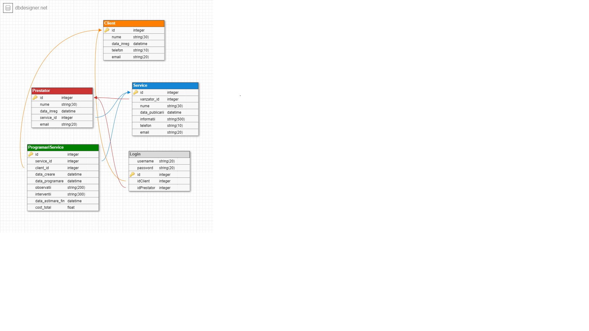
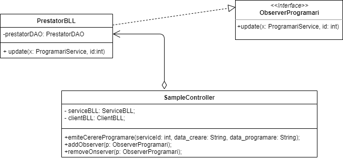
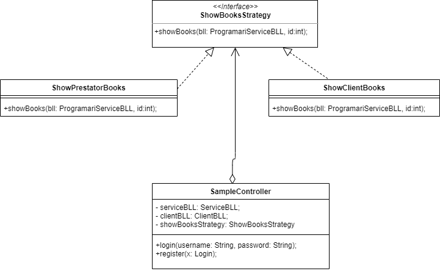
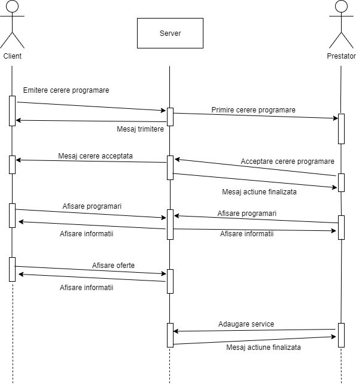

# Proiect Service Auto Booking Online

Proiectul de fata reprezinta o platforma online ce contine o colectie de oferte despre service-uri auto pentru un grup de utilizatori care pot fi persoane fizice sau juridice.
Sistemul contine o baza de date in care se vor stoca date despre utilizatori, dar si despre service-urile care au ales aceasta sa-si prezinte ofertele pe aceasta platforma. De asemenea atat clientii cat si prestatorii vor beneficia de o interfata de comunicare accesibila si usor de folosit prin care acestia isi vor transmite mesaje.
Platforma reprezinta un serviciu de programare online la un service auto si functioneaza astfel: un client are posibilitatea de a vizualiza oferte legate de service-uri auto. Aceste oferte sunt create de prestatori si contin detalii despre costuri, diverse servicii si preturi, date de contact si date disponibile pentru programare la reparatie, dar mai pot contine si poze cu service-ul respectiv si detalii despre mecanicii pe care ii are angajati. Prestatorul va avea nevoie de acordul administratorului pentru a posta o oferta. Clientul poate alege o oferta si sa se programeze la un service ales, iar dupa ce realizeaza acest lucru, se deschide o conversatie intre el si prestatorul care a postat oferta de service pe care clientul a ales-o. In aceasta conversatie ei isi pot trimite mesaje. De exemplu: prestatorul ii transmite clientului o dauna care a descoperit-o in plus la masina lui, poate atasa si poze si poate sa-i ofere clientului reparatia acestei daune.

Practic prestatorii sunt patronii de service.

## Descrierea utilizatorilor

Actorii din aceasta platforma sunt:

-	 Clientii
-	 Prestatorii
-	 Vizitatorii
-	 Administratorul

### Administraror

Administratorul va fi cel care va avea grijă de întreţinerea sistemului, configurarea acestuia, într-un cuvânt – administrarea sistemului. Acesta va putea adăuga, elimina, modifica profiluri de utilizatori, deci va avea acces asupra datelor stocate in baza de date. Însă, pentru a avea acces la toate aceste facilităţi, administratorul va trebui sa se autentifice cu o parola. La sfârşitul sesiunii de lucru, acesta se va deautentifica de la sistem. Deasemenea  va administra cele doua sisteme: sistemul de newslettering, care trimite fiecarui utilizator (client) un mesaj cu care il va notifica cu produsele nou ararute si cea a ofertelor speciale si sistemul de notificari care trimite mailuri fiecarui utilizator (client si vanzator) in legatura cu mesaje noi primite. Tot el va administra si interfata de comunicare dintre vanzator si client si interfata de afisare a ofertelor pe care le va verifica inainte ca acestea sa fie postate pe pe site.

### Client

Clientul, adică utilizatorul obişnuit, va putea să se înregistreze, sa-si stearga contul, sa vizualizeze ofertele de pe platforma, sa trimita mesaje unui vanzator, sa aleaga o oferta si sa creeze o programare. De asemenea poate accesa un istoric al ofertelor (service-urilor) alese, dar si o interfata prin care va vedea programarile curente la service-urile alese.

### Prestator

Acest tip de user va putea sa se inregistreze cu calicatea de prestator, va putea sa isi stearga contul, va putea sa creeze si sa posteze (cu acordul administratorului) oferte pe platforma, sa acceseze un istoric al clientilor, sa isi editeze profilul creat, si sa trimita un mesaj clientului. De asemenea el poate sa vada clientii curenti care au ales oferta postata de ei.

### Vizitator

Vizitatorul, adica utilizator temporar, va putea doar vizita magazinul si sa vizualizeze ofertele, fara insa a putea alege o oferta sau a trimite un mesaj unui vanzator, va putea avea optiunea de intregistrare ca si client sau ca si vanzator.

## Unelte folosite

-	 Baza de date a fost construita folosing MySQL, iarconectarea la Intellij a fost facuta prin documentul .jar din folderul BDConnection.
-	 Conectarea web este facuta prin springboot.
-	 Testele JUnit se fac folosind Mockito.

## Implementare

S-au construit clasele aferente utilizatorulor si inca o clasa de login care ne ajuta sa diferentiem utilizatorii. Accesul la informatiile din baza de date este facut prin metodele din clasele ce se afla in pachetul 'dao'. In acest pachet exista o clasa generica AbstractDAO prin care obtinem majoritatea datelor. Aceasta clasa creeaza o conexiune la baza de date si obtine datele prin executarea unui query asupra bazei de date, iar obiectele le construieste folosind reflexia. Taote celelalte clase din pachetul dao folosesc clasa AbstractDAO.

## Diagrama bazei de date

## Diagrama Design Pattern-ului Observer

-	Pentru a notifica prestatorii cand au primit cereri de programare de la clienti, am implementat design pattern-ul observer astfel: Clasa prestator este observer-ul care primeste update atunci cand se emite o cerere. Emitatorul este clasa principala in care se creeaza cererea.
-	In clasa PrestatorBLL exista o tupla de programari neconfirmate de tipul (id,listaProgramari) unde id corespunde id-ului prestatorului din baza de date caruia ii apartine lista de programari neconfirmate. La update, aceasta lista se va actualiza si se va adauga cererea noua.

## Diagrama Pattern-ului Strategy

-	Pattern-ul strategy se foloseste pentru a selecta, din mai multi algoritmi, unul singur care va efectua cerintele contextului in care este aplicat. Clientul va vedea doar rezultatul fara sa stie ce algoritm este utilizat.
- 	Contextul in care acest pattern este folosit in proiect este in cazul afisarii programarilor. Daca unser-ul logat este un prestator, atunci ar trebui sa-i afisam programarile care implica service-urile pe care acesta le detine, iar daca user-ul logat este client, atunci o sa-i afisam programarile pe care acesta si le-a facut.
-	Pentru aceste cerinte am implementat interfata ShowBooksStrategy in care se mentioneaza metoda showBooks ce are ca parametru un obiect de tipul ProgramariServiceBLL si un integer numit id. Aceasta metoda returneaza un ArrayList de obiecte de tip ProgramariService ce reprezinta lista programarilor care vor fi afisate. Mai departe avem doua clase ShowClientBooks si ShowPrestatorBooks care implementeaza interfata ShowBooksStrategy si definesc metoda showBooks.
-	In clasa ShowClientBooks, metoda returneaza, cu ajutorul obiectului de tip ProgramariServiceBLL, programarile ce au ca si id al clientului, id-ul clientului conectat, folosind metoda selectByClientId definita in clasa ProgramariServiceBLL.
-	In clasa ShowPrestatorBooks, metoda showBooks cauta prima data toate service-urile prestatorului cu id-ul primit ca parametru si apoi creeaza o lista din toate programarile care implica aceste service-uri, dupa care o returneaza. Se foloseste metoda selectByIdService definita in clasa ProgramariServiceBLL.
-	In clasa SampleController avem o instanta a interfetei ShowBooksStrategy care va fi un obiect de tipul ShowClientBooks sau ShowPrestatorBooks in functie de user-ul care s-a logat folosind metoda login. Dupa logare, se poate folosi metoda showBooks care va afisa toate programarile, stiind pe care sa le aleaga datorita interfetei ShowBooksStrategy.

## Diagrama de secventa

- Diagrama de secventa  Diagrama de secventa descrie cronologic interactiunea obiectelor, identificand mesajele schimbate intre obiecte ca raspuns la un eveniment, impreuna cu secvența mesajelor. Diagramele secventiale cuprind obiectele care fac parte dintr-o anumita colaborare si descriu secventa de stimuli transmisi intre obiecte in cadrul unei interactiuni.
- In aceasta diagrama prezentam sunt prezentate cateva functionalitati ale proiectului, dar de asemenea si faptele petrecute in urma utilizarii lor.

